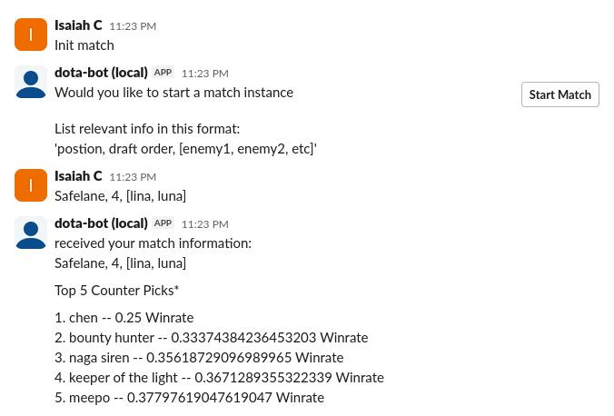

Dota bot leverages up-to-date match information to calculate different hero matchups in order to provide the potential best match counter.

Using [Open-Dota](https://docs.opendota.com/) the program pulls hero matchup win rates and simply chooses the best hero to match the current position and enemy hero pool.

## **How to use**
 1. Requirement

	 -  Git
	 - Python3
	 - A slack workspace where you can install apps

 2. Clone repo

	 Run this to clone repo into a folder:
	` git clone https://github.com/Cunning077/Dota-matchup-bot.git`  

3. Install dependencies

	create a venv environment and then open it
		` python3 -m venv .venv` 
		`source .venv/bin/activate` 

	This will install the necessary dependencies to run the bot
		`pip install -r requirements.txt` 

4. Create the slack app
	- Now we have to create slack api tokens to do this navigate to [Slack API](https://api.slack.com/apps)

	- Click the green button in the top right quadrant that says -
	 "Create New App" .
	 
	 - Click the "create from manifest option", And ensure you have the JSON version selected then paste the contents of the 'manifest.json' file in the cloned repo, then select the workspace you want to use.

	- From there navigate to your app and look for the socket mode section and ensure it is enabled

	- Go to basic information and press "Generate token and scopes", Give it any name and click the "add scope" button

	-Give it the "connections:write" scope, click generate

5. Add token to bot
	From here you need to create a .env file in the dota bot folder and paste the following tokens in this style:
		
		Token generated above:
			SLACK_APP_TOKEN=your_token
		
		Token generated under OAuth & Permissions in the OAuth token section:
			SLACK_BOT_TOKEN=your_token
	
6. Start the program
		
		Simply run:
				` python app.py` 

## Usage
To start a match run 'Init match', this will initate the process.

From there follow the instructions as listed, put in no more than 5 heroes and simply read the results

